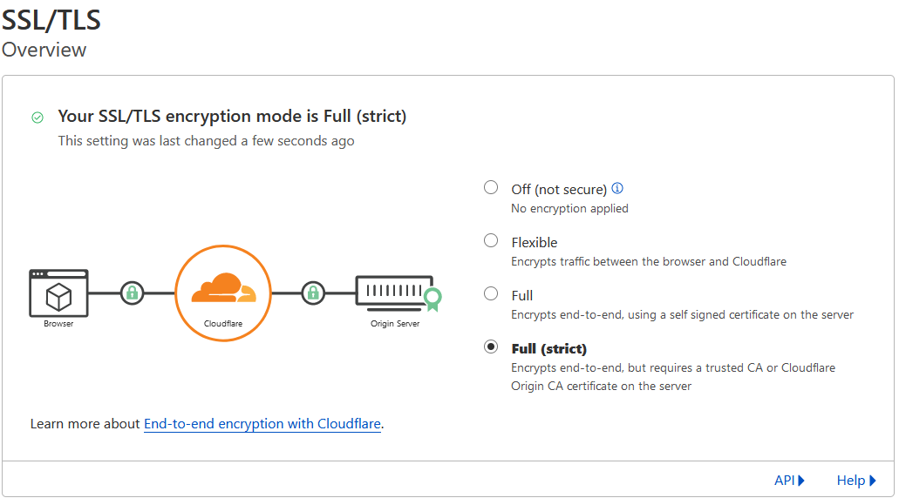
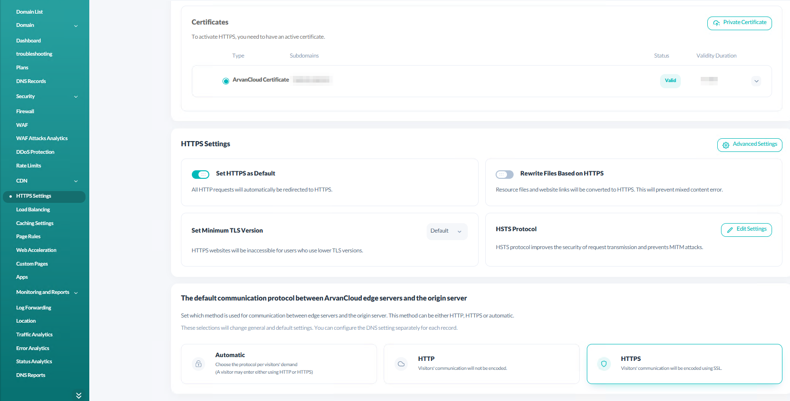
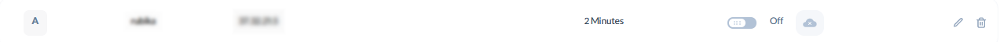
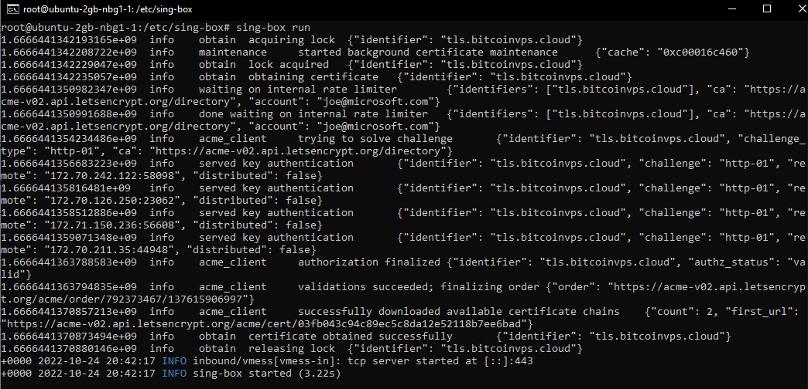
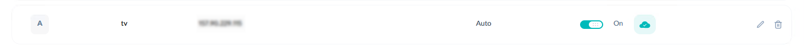
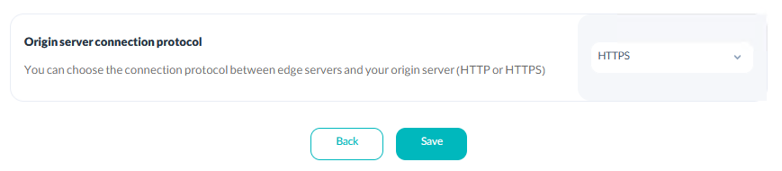

# VMESS-Port:443-WebSocket-CDN+TLS

  

We hide our node IP behind a CDN and use Websockets on port 443 for transport. Also we use sing-box acme to request a valid SSL certificate for your subdomain.

  

### I highly recommending using our services at [bitcoinvps.cloud](https://bitcoinvps.cloud). We provide free assistance with installing and configuring sing-box on our servers.

  

## Server Setup:

  

You can now download and edit the server configuration file:

  

    curl https://raw.githubusercontent.com/bitcoinvps/sing-box-easy/main/sing-box-config/vmess-ws-cdn-tls/server/config.json > /etc/sing-box/config.json
    
    nano /etc/sing-box/config.json

  

It is possible to change these two parameters or leave them as they are:

  

- **UUID**: [Can be generated on this page if necessary.](https://www.uuidgenerator.net/version4)

- **Path**: /stream is the default path, you can change it or leave it as is

- **server_name**: subdomain pointing to your VPS IP
- **domain**: same as server_name

  
  

## CDN Setup:

  

Connect your domain to Cloudflare.

Navigate to SSL/TLS-> Overview

Make sure you match the below screenshot:

  



  

Create an A record for a subdomain (with any name you wish) pointing to your sing-box VPS:

  


  

You must create an A record with **cloud proxy off** if you intend to use Arvancloud Free CDN or other CDN. The reason for this is that letsencrypt can verify your subdomain. Take a look at the screenshots below:

  



  
  



  

Ensure that your VPS provider supports IPv6. IPv6 can be configured with an AAAA record. IPv6 has been reported to work with nearly all protocols by some users. [Bitcoinvps.cloud](https://bitcoinvps.cloud) provides IPv6 for free with every VPS.

Sing-box should now be able to generate the certificate:

```

cd /etc/sing-box/ && sing-box run

```


Once your certificate has been successfully installed, access your CDN and enable cloud proxy. Logs should be turned off in production.




## Client configuration

  

A VMESS URL can be built to import into any client. Alter UUID, Path & your CDN subdomain:

  

vmess://ws+tls:**3ba295b2-5336-40fa-bfc8-69487d169b61-0**@**tls.bitcoinvps.cloud**:443/?path=**/stream**#vmess@**tls.bitcoinvps.cloud**:443
  

If you use any other clients that support VMESS protocol, then add manual config with following:
  

Add (manual) VMESS Server:

- You can type anything you like for name/alias/remarks

- For the address, use the CDN subdomain. Eg. : tls.bitcoinvps.cloud

- Port: 443

- UUID: should match your server config.json UUID. default: 3ba295b2-5336-40fa-bfc8-69487d169b61

- Encryption: Auto

- Transport Protocol: WS

- Path: should match the path in config.json on your server. default: /stream

- Select TLS

- alpn: Only Select http/1.1
  

It is now possible for you to [set up Sing-Box service and run the server](https://github.com/bitcoinvps/sing-box-easy#run-sing-box-server/). After that, you can connect using the client of your choice.